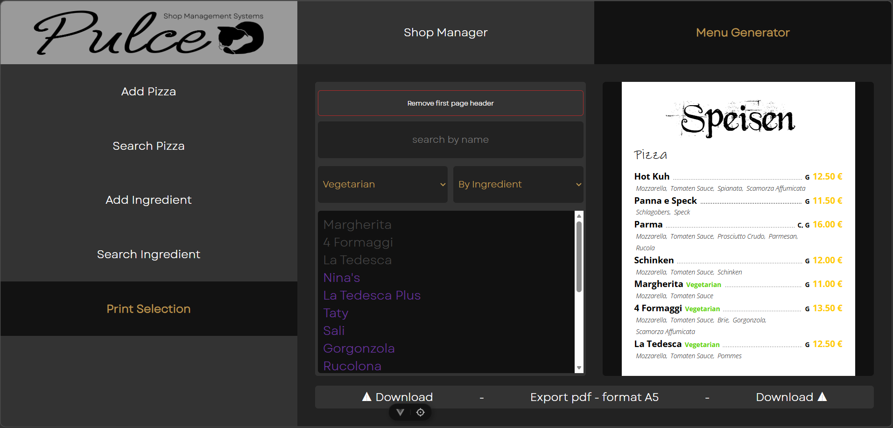
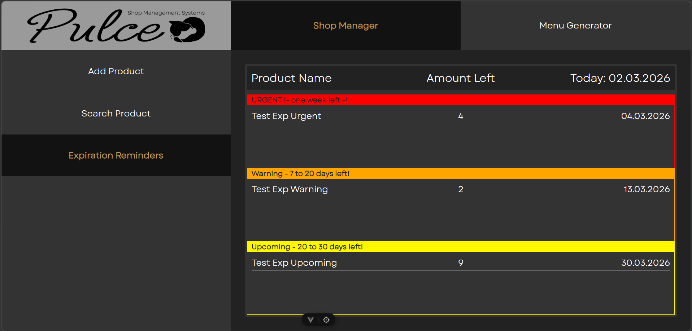

Pulce – Smart Gastro & Inventory Management
Pulce is a full-stack solution designed to digitize manual workflows in small-scale gastronomy. It moves management away from tedious paperwork and static graphic design into a dynamic, automated ecosystem.

Real-World Impact: This application is currently deployed and active in a local business, managing real inventory and live digital menus.

The "Why" (The Problem)
In small businesses, managing inventory while serving customers is demanding. Manual tasks lead to:

Waste: Items expiring unnoticed.

Inconsistency: Prices or ingredients changing in the kitchen but not on the printed menu.

Time Loss: Redesigning menus in graphic software for every minor change.

Pulce automates these processes, allowing the owners to focus on their guests rather than their spreadsheets.

Key Features
Inventory & Expiration Tracking
Smart Alerts: Items are tracked with expiration dates and categorized into a 3-step warning system: Upcoming, Warning, and Urgent.

Automated Email Notifications: The system proactively emails the user when an item hits an expiration threshold, including the name, date, and remaining stock.

POS Integration: The app receives data from the existing Kassa (POS) system. When a bill is printed, ingredients are automatically subtracted from the database in real-time.

Digital Menu & Design Automation
Dynamic Management: Create, modify, or remove pizzas, ingredients, allergens, and pricing instantly.

Auto-Generated Graphics: With one click, the system generates a professional A5 PDF menu in a pre-defined graphic design, ready for print or social media. No external design tools required.

🛠 Tech Stack
Frontend: Vue.js 3 (Logic & Dynamic UI)

Backend: Java / Spring Boot (REST API & Automated Mailing Service)

Database: MariaDB (Relational Data Mapping)

Challenges & Learning
The most rewarding part of this project was architecting a scalable system. Learning a new framework (Vue.js) while ensuring the backend could handle real-time POS data was a significant milestone. I focused heavily on building a system that doesn't just work for today, but can be expanded as the business grows.

🗺 Road Map (The Future)
[ ] Full Menu Coverage: Expanding the automation logic to include beverages and desserts.

[ ] Live Web Menu: I am currently building a customer-facing Vue.js site that fetches data directly from the Pulce database. This will allow the owner to update a price in the app and have it reflect on their website instantly—zero coding required.

